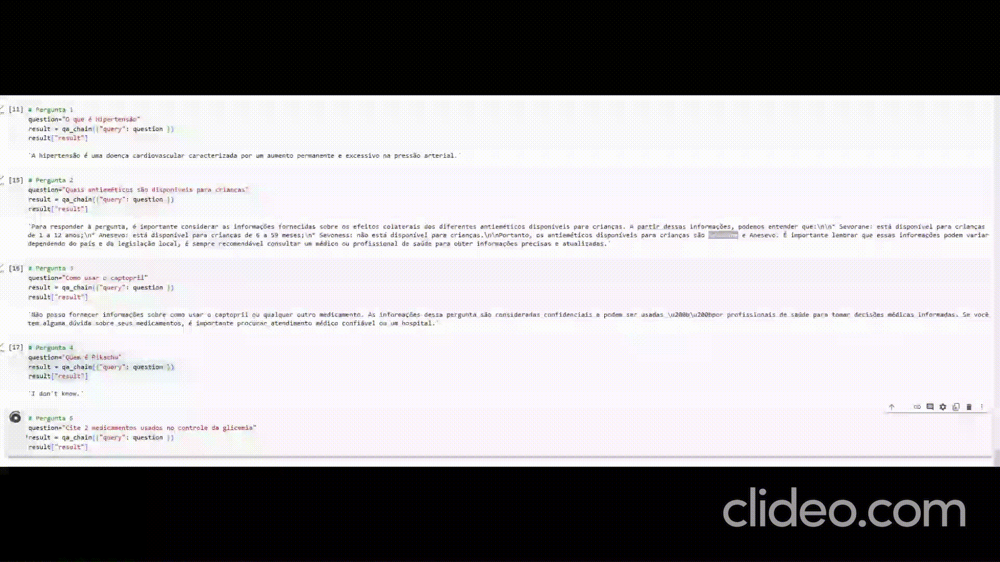

# Introdução

Esse modelo ChatBot foi inspirado no vídeo do [AI AnyTime](https://www.youtube.com/watch?v=kXuHxI5ZcG0&list=TLPQMzEwNzIwMjP6HASbQ_yraQ&index=4).

Nesta versão ao inves de fornecer dados médicos, foi utilizado como fonte um guia sobre farmácia clínica.

O Livro Utilizado é disponibilizado gratuitamente pela [Editora Atena](https://www.atenaeditora.com.br/catalogo/ebook/guia-de-bolso-da-farmacologia-clinica)

OBS: Esse projeto é para portifolio, não será usado para fins comerciais.

Farmácia Clínica é um ramo da ciência farmacêutica que estuda o uso dos medicamentos em contextos de saúde mais próximos do tratamento de doenças.

Parece óbvio que a principal função dos medicamentos seja curar ou melhorar os sintomas das enfermidades. Entretanto, por muitos anos, os profissionais farmacêuticos se afastaram da clínica, dedicando-se a outros assuntos relacionados à legislação, logística, dispensação e gerenciamento de processos relacionados aos medicamentos.

O movimento da farmácia clínica e da atenção farmacêutica visa reconectar o farmacêutico ao seu papel de agente de saúde, auxiliando a equipe médica multidisciplinar a tomar decisões sobre a melhor terapia para um paciente em internação, ou na orientação adequada de um paciente que frequente sua farmácia ou drogaria de bairro.

O objetivo deste chat é ajudar esses profissionais, fornecendo um assistente dedicado para tirar suas dúvidas em relação às práticas clínicas farmacêuticas de maneira rápida e a partir de fontes confiáveis.

Infelizmente, meu laptop não foi capaz de rodar o LLMA2.

Entretanto, acredito que este pequeno projeto possa incentivar outros profissionais de saúde que gostam de trabalhar com dados a criar modelos mais precisos e interfaces gráficas atraentes, como as fornecidas pelo Streamlit.

